# CFS Tag Writer — User Guide

A step-by-step walkthrough of every workflow. For an overview and install
instructions, see [README.md](README.md).

> Only read, clone, or write tags for spools **you own**.

## Main menu

Launch the app to reach the main menu: **Read**, **Write**, **Erase**,
**Saved**, **Settings**, **Help**, and **About**.

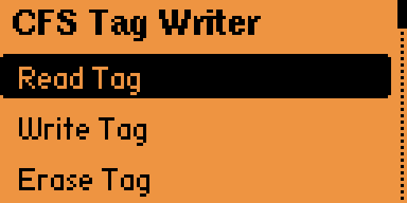

## Read a tag

Place a CFS spool tag on the back of the Flipper and choose **Read Tag**. The
result screen shows the brand, material, color, weight and length, serial, and
UID.

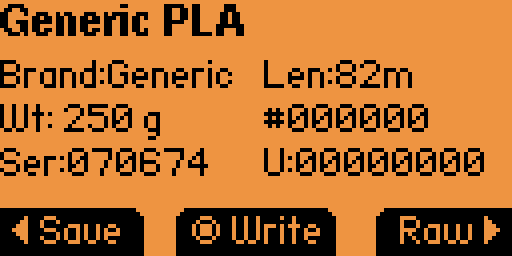

From the result screen you can **Save** the tag, **Write** it (Clone or
Edit & Write), or open **Raw** for details. A successful read plays a sound.

**Raw / Details** shows the catalog match and the decoded 48-byte payload as
ASCII + hex (scroll down to see it).

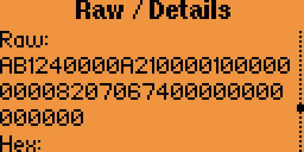

## Write a tag from scratch

Choose **Write Tag** to build a spool with the wizard. Each step shows the
current selection; press OK to advance.

1. **Brand** — Generic or Creality (defaults to your Settings choice).

   

2. **Material** — the products in the built-in filament catalog for the chosen
   brand (e.g. Generic PLA, Generic PETG… or Hyper PLA, CR-PETG…).

   

3. **Color** — pick from the palette, or enter a custom color.

   

4. **Weight** — 250 g / 500 g / 600 g / 750 g / 1 kg. The weight sets the
   encoded filament length automatically (presets are editable in Settings).

   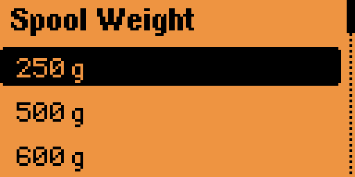

5. **Confirm** — review everything, then **Write** (or **x2** for both tags, or
   **Save**).

   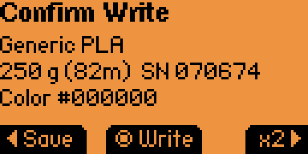

Hold the tag on the back when prompted; the app writes and verifies.

## Clone / Edit & Write

From a **read** result or a **Saved** entry, choose **Write**:

- **Clone** writes the fields exactly as-is (serial kept from the source).
- **Edit & Write** opens the wizard pre-filled with the existing values so you
  can tweak a field before writing.

## x2 — dual-tag writing

A CFS spool carries **two** tags with identical data. Choose **x2** on the
confirm screen to write both:

1. Write **tag 1** and hold it until it completes.
2. When prompted, **remove tag 1**, place **tag 2**, and press **OK**.
3. The app writes tag 2 the same way.

## Save and the Saved Tags library

**Save** a tag (from a read result or the write-confirm screen) to name it and
keep it. Pre-filled with a brand, material, color, and serial-number label;
edit as you like. Tags are stored as standard Flipper MIFARE Classic **`.nfc`**
files in the app's data folder.

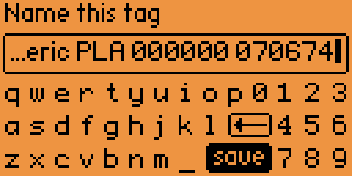

Open **Saved Tags** to browse for a `.nfc` file. The file browser starts in the
app's folder, but you can navigate anywhere — so you can also open `.nfc` dumps
saved by the stock NFC app. Selecting a file offers **View**, **Write** (clone),
**Edit & Write**, and **Delete**.

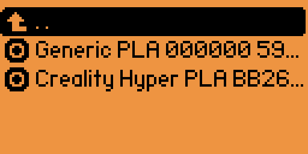
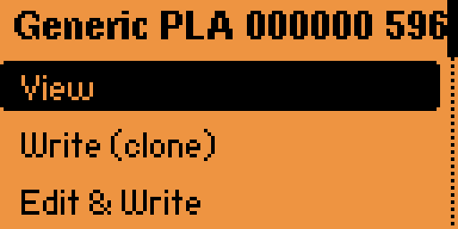

## Erase a tag

Choose **Erase Tag** to wipe a tag back to blank. Confirm, then hold the tag.

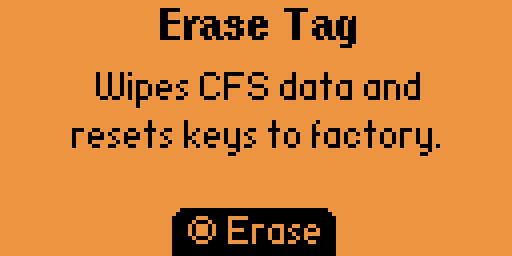

## Settings

Open **Settings** to configure:

- **Default brand** — Generic or Creality, used when starting a from-scratch write.
- **Serial mode** — how the serial is chosen (keep source on clone, random,
  sequential, or prompt).
- **Weight presets** — edit the length each weight maps to.
- **Self-Test** — runs the crypto/data round-trip check.

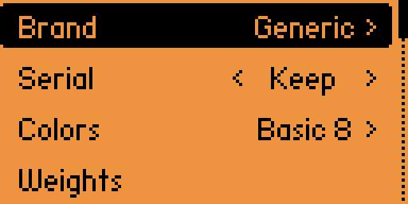
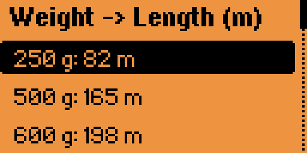

## Help and About

**Help** shows a condensed version of this guide on-device. **About** shows the
app version, author, and license.

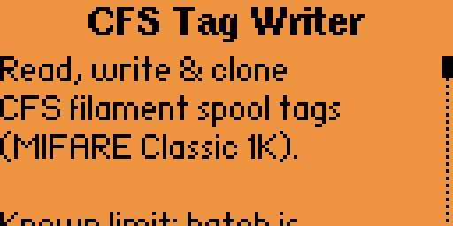
